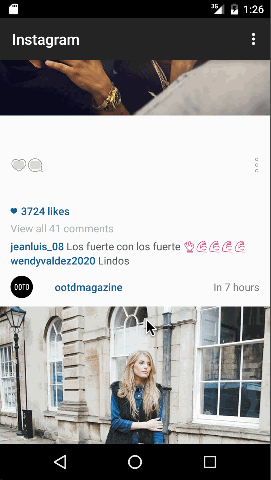

# android-instagram

This is the starter project for the Instagram Client Project. 

Time spent: 5 hours spent in total

Completed user stories:

 * [x] Required: Connect the app with the Instagram API and get real time data using the android-async-http library library.
 * [x] Required: Show the last 2 comments for each photo
 * [x] Required: User can view all comments for an image within a separate activity.
 * [x] Required: User can share an image to their friends or email it to themselves.
 

Walkthrough of all user stories:

GIF created with [LiceCap](http://www.cockos.com/licecap/).

